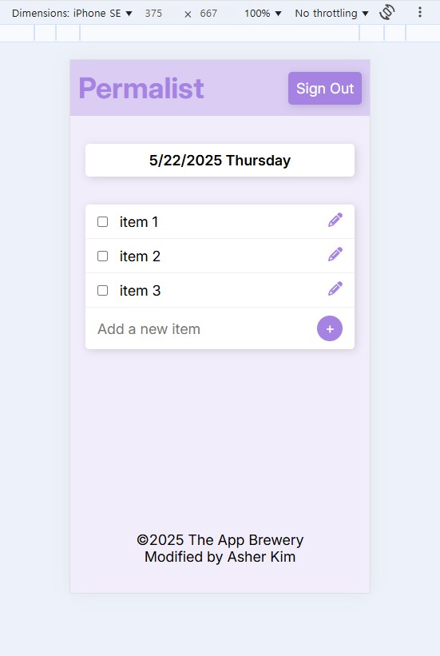
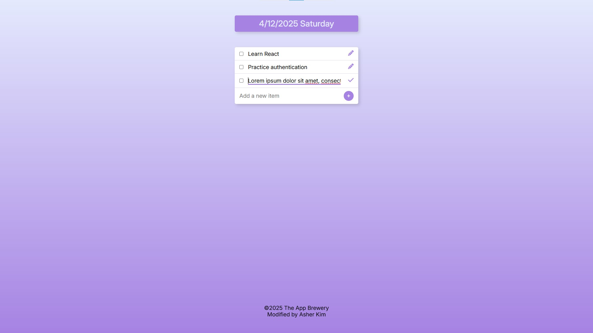
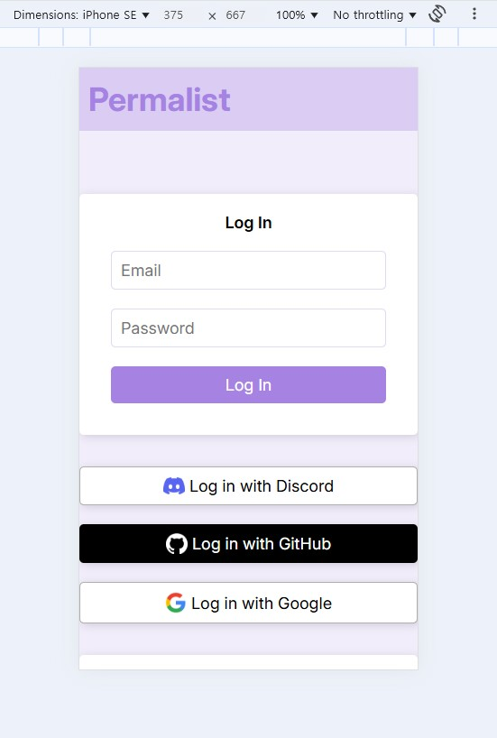
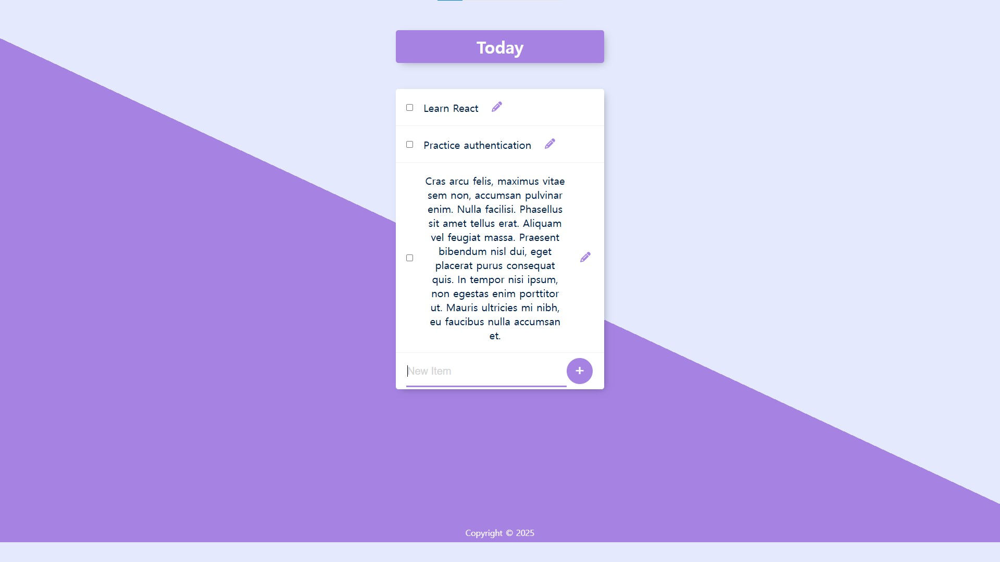

# Permalist (할 일 목록)

## Modified Version Screenshots (수정 버전 스크린샷)

## Original Version Screenshot (기존 버전 스크린샷)

## About the App

To-do list app which, upon authenticating (with email or OAuth 2.0), saves in and loads from database (PostgreSQL) to-do items.

This project came from a Udemy course by Angela Yu, The Complete Full-Stack Web Development Bootcamp.

I modified it the following way:

1. Add authentication
   - Bcrypt with email and password
   - OAuth 2.0 with Discord, GitHub, and Google
2. Add new features
   - Date and day
   - Autofocus on input when editing an item
   - Reload on clicking outside the to-do list or pressing esc
   - Prevent ejs crash from having 0 items by adding "<%= locals.items && ..."
3. Rework UX
4. Minimize codes (most notably css)

## 앱에 관하여
간단한 할 일 목록(to-do list) 앱이며, 인증 후 데이터베이스를 이용(저장 및 불러오기)할 수 있습니다.

유데미 강의 The Complete Full-Stack Web Development Bootcamp(저자 Angela Yu)에 포함된 프로젝트이며, 다음과 같이 발전시켰습니다.

### 1. 인증 추가
이메일 및 패스워드, 혹은 OAuth 2.0 인증 후 할 일 목록 저장 및 불러오기 가능

#### 1-1. 이메일 및 암호
bcrypt를 사용해 암호를 salt rounds 수 만큼 hash 후 데이터베이스(postgreSQL)에 저장. bcrypt보다 안전하다 평가되는 argon2 등이 있음에도 bcrypt의 좋은 균형 때문에 사용(적당히 안전하고, resource 덜 먹기에 적당히 빠르고, 쓰기 쉬움). 또한, 보안 전문가가 아닌 이상 Node.js의 crypto 라이브러리같이 이것저것 수동으로 설정해야 하는 라이브러리보다 대부분 알아서 해주는 bcrypt 같은 라이브러리가 훨씬 더 안전하다 판단함.

인증 실패 시 이메일을 적어야 하는 input에 이메일이 자동 입력 입력(예: sign-up 시, 이메일이 이미 등록돼있는데 암호가 틀렸다면 re-render 후 login input에 이메일 자동 입력, 계정이 없는데 로그인 시도하면 re-render 후 signup input에 이메일 자동 입력)
passport의 LocalStrategy 대신 req.login() 메서드를 썼는데, local strategy를 쓰면 구현하고 싶었던 기능을 못 쓰기 때문. 기능은 다음과 같음:

passport local strategy로 사용하는 passport.authenticate()의 구조 때문인데, successRedirect 설정 후 콜백함수로 이메일을 input에 넣으려 하면 작동하지 않음(반대로 failureRedirect 설정 후 콜백함수 란은 작동.

인증 후엔 session에 얹은 passport가 로그인(세션) 유지.
#### 1-2. OAuth 2.0
passport strategy로 디스코드, 깃헙, 구글 OAuth 2.0 인증 구현. 페이스북 등 더 많은 인증 수단을 넣을 수도 있었지만 귀찮았음.
### 2. 기능 추가
날짜와 요일, 아이템 수정 시 autofocus, 할 일 목록 밖 클릭 혹은 esc 입력 시 리로드, "<%= locals.items && ..."를 넣어 할 일 목록이 0개일 때 충돌 방지
   
### 3. UX 재디자인
스크린샷에 보여지듯 navbar(제목 및 signout 버튼), 할 일 목록 텍스트 왼쪽 정렬, body 100vh로 min-height 설정(기존 버전 스크린샷 아래 회색 바 참고), 반응형 디자인 추가 등

### 4. 코드 최소화
보다 읽기 쉽도록 코드 최소화(특히 css)
