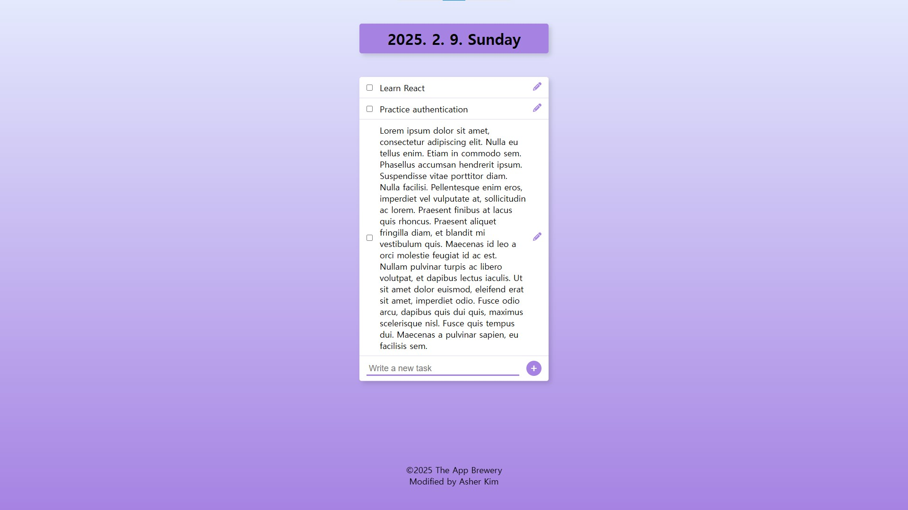
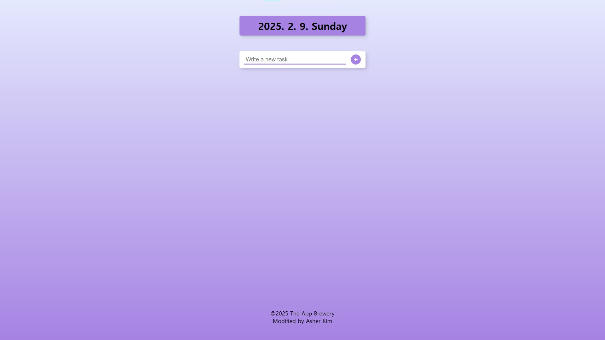
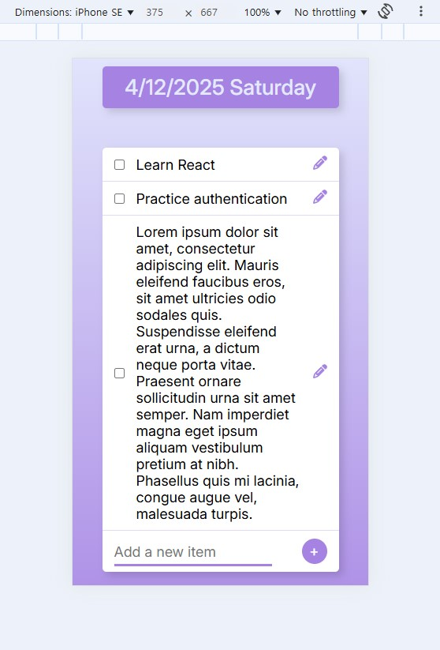
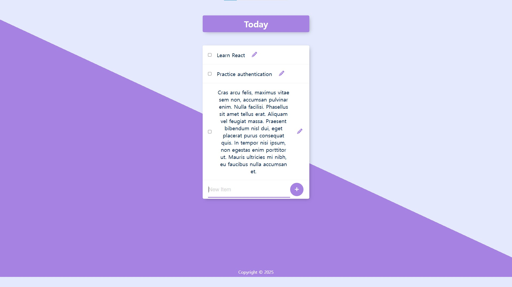

# Permalist

Modified Version Screenshot #1

Modified Version Screenshot #2

Modified Version Screenshot #3 - Responsive\

Original Version Screenshot

## How to Use

1. Download and install Postgres
2. Configure the following, either in index.js or via a dotenv file:
    - port (usually 5432 for Postgres)
    - host
    - database    
    - user
    - password
3. Run queries.sql queries in Postgres
4. Start the server and send a get request

## About the App

This project came from a Udemy course by Angela Yu, The Complete 2024 Web Development Bootcamp.\
I modified it the following way:

1. Add new features
    - Add date and day
    - Autofocus on input when editing an item
    - Prevent ejs crash from having 0 items by adding "<%= if (locals..."
2. Rework UX
3. Minimize codes (most notably css)
