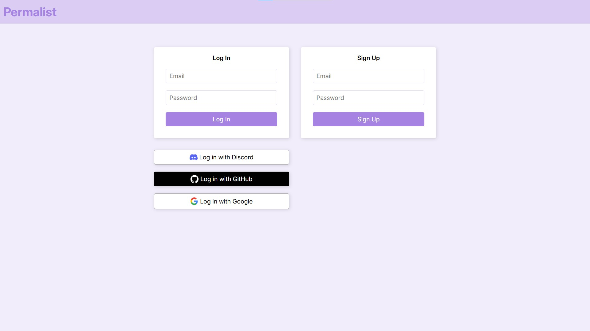

# Permalist (할 일 목록)

## Modified Version Screenshots (수정 버전 스크린샷)

## Original Version Screenshot (기존 버전 스크린샷)

## About the App

This is a simple to-do list app which, upon authenticating (with email or OAuth 2.0), saves in and loads from database to-do items.

This project is a part of The Complete Full-Stack Web Development Bootcamp (on Udemy, by Angela Yu), and I improved it the following way.

### 1. Add Authentication
Upon login, with email & password or OAuth 2.0., user can save in and load from database to-do list items.

#### 1-1. Email and Password
The app saves password (hashed for number of salt rounds set, using bcrypt) in database (postgreSQL). argon2 has a better reputation for security, but I used bcrypt for its balance (secure enough, performant enough, and easy to use). More importantly, I stayed away from packages like crypto (Node.js native module), with which I have to set many options manually. Unless the dev is a security expert, I believe it is better to use third-party packages like bcrypt, which takes care of most things for the dev. 

I wanted to remove the nuisance of re-entering email if login or sign-up failed, so I made res reuse email address contained in req.body. So, if you fail sign-up because you already have a registered account, you are redirected to the login/sign-up page with login input filled with entered email. Similarly, if you fail login because you don't have a registered account, you are redirected to the page with sign-up input filled with your email. Using EJS, I filled value of both inputs with "<%= locals.logInUsername && logInUsername %>" and "<%= locals.signUpUsername && signUpUsername %>", respectively.

I wanted to use passport's LocalStrategy but couldn't, so I used req.login() to authenticate session. Regarding passport.authenticate(), callback functions written after failureRedirect worked, but those wirtten after successRedirect didn't. Since I couldn't come up with anything other than putting entered email in res in the callback after successRedirect, I simply used req.login(). I think the issue has to do with how passport.authenticate() is structured.

#### 1-2. OAuth 2.0
I enabled OAuth 2.0 with Discord, GitHub, and Google. I could have added more but was too lazy (since it's a practice project :)).

### 2. Add New Features
Date and day, autofocus on input when editing a to-do item, reload on clicking outside the to-do list or pressing esc, prevent ejs crash from having 0 items by adding "<%= locals.items && ...", etc.

### 3. Redesign UX
I added navbar (which contains page title and sign out button, as seen in the screenshot), made to-do list items align left, set body's min-height 100vh (the original version's body height was less, and its screenshot shows a gray bar at the bottom), added responsiveness, etc.

### 4. Minimize Codes
I minimized codes (most notably CSS) for easier read and understanding.

## 앱에 관하여
간단한 할 일 목록(to-do list) 앱이며, 인증 후 데이터베이스를 이용(저장 및 불러오기)할 수 있습니다.

유데미 강의 The Complete Full-Stack Web Development Bootcamp(저자 Angela Yu)에 포함된 프로젝트이며, 다음과 같이 발전시켰습니다.

### 1. 인증 추가
이메일과 암호, 혹은 OAuth 2.0으로 인증. 이후 할 일 목록 저장 및 불러오기 가능.

#### 1-1. 이메일 및 암호
입력한 암호를 bcrypt로 salt rounds 수 만큼 hash 후 데이터베이스(postgreSQL)에 저장. bcrypt보다 안전하다 평가되는 argon2 등이 있음에도 좋은 균형 때문에 bcrypt 사용(적당히 안전하고, resource 적당히 먹고, 적당히 빠르고, 쓰기 쉬움). 또한, 보안 전문가가 아닌 이상 Node.js의 crypto같이 이것저것 수동으로 설정해야 하는 라이브러리보다 대부분 알아서 해주는 bcrypt 같은 라이브러리가 훨씬 더 안전하다 판단함.

인증 실패 시 이메일을 재입력하는 번거로움을 없애고 싶었는데, 실패 시 req.body에 담겨있던 이메일을 res에 다시 담아 보내는 식으로 해결함. 이미 계정이 있어 가입에 실패하면 입력했던 이메일이 로그인 섹션의 이메일 input에 자동으로 채워지며, 마찬가지로 가입한 계정이 없어 로그인에 실패하면 입력했던 이메일이 가입 섹션의 이메일 input에 채워짐. EJS로 input의 value를 "<%= locals.logInUsername && logInUsername %>", "<%= locals.signUpUsername && signUpUsername %>"으로 채워 구현함. 

passport의 LocalStrategy를 쓰면 이 기능을 못 구현하기에, req.login() 메서드로 세션을 인증함(물론 bcrypt.compare()를 통한 인증 후). passport.authenticate()의 구조 때문으로 보이는데, failureRedirect 후의 콜백함수는 작동했는데 successRedirect 후의 콜백함수는 작동하지 않았음. successRedirect 후의 콜백함수에 이메일을 넣어 client-side에 보내는 방법밖에 떠오르지 않아, 그냥 req.login() 씀.

#### 1-2. OAuth 2.0
passport로 디스코드, 깃헙, 구글 OAuth 2.0 인증 구현. 페이스북 등 더 많은 인증 수단을 넣을 수도 있었지만 연습용 프로젝트이기도 하고 귀찮기도 했음.

### 2. 기능 추가
날짜와 요일, 아이템 수정 시 autofocus, 할 일 목록 밖 클릭 혹은 esc 입력 시 리로드, "<%= locals.items && ..."를 넣어 할 일 목록이 0개일 때 EJS 충돌 방지 등
   
### 3. UX 재디자인
스크린샷에 보여지듯 navbar(제목 및 Sign Out 버튼 포함) 추가, 할 일 목록 왼쪽 정렬, body 100vh로 min-height 설정(스크린샷에 보여지듯 기존 버전은 100vh 미만, 화면 아래 회색 바 생김), 반응형 디자인 추가 등

### 4. 코드 최소화
보다 읽기 쉽도록 코드 최소화(특히 css)
